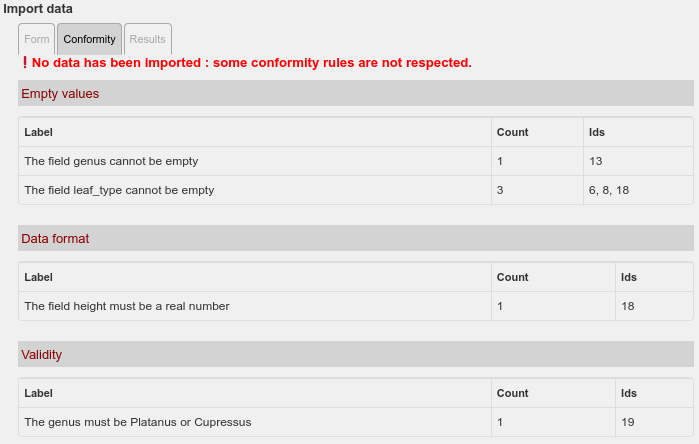
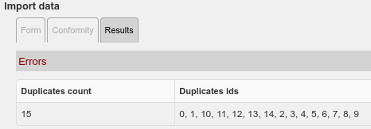

# LizMap import module

## Presentation

[LizMap](https://www.lizmap.com/) module to enable the **import of data from CSV files**
into configured **PostgreSQL layers**.

The map editor can **activate the import tool** for a layer inside a LizMap project.

When the user clicks on the configured layers in the `Layers` panel, a new interface
will be displayed in the `Information` panel displayed at the right.


The user can then **upload a CSV file** and either:

* **validate** the uploaded CSV data against a set of rules defined by the editor
* **import** the data into the target layer if the data is correct.

## Principle

The map editor will configure:

* for **which layer(s)** the authenticated user can import data. The target layer
  PostgreSQL `schema` and `table` must be specified.
* which **group(s) of users** can access the tool in the map interface.
* which **fields** can be imported or modified in the target table
* if the CSV contains **geometry data** and of which type (`lonlat`, `wkt`, `none`)
* the set of **rules** that define a **valid record**. Each rule will be tested
  for all the **CSV features**.
* The name of the **mandatory unique ID field** to allow identifying each record:
  the tool will check that this field is present and that its values are all unique.
* The list of **fields** which must be used to **check for duplicates** between the
  CSV data and the table data.
* which type of action you allow the user to perform: INSERT, UPDATE or UPSERT

If an **error is detected** (wrong CSV format, missing fields, missing unique id field, etc.)
the tool will cancel the import and **display an error message**.

If some **features do not respect the rules**, a table will show the list of rules
with the **problematic identifiers**.



Depending on the configured type of import (insert, upsert or update), the behaviour will vary:

* For the type `insert`, if some records contained in the CSV files are **duplicates**
  of some target layers records (in the PostgreSQL table), the whole import will be **canceled**
  by default. A list of the **duplicated records ID** will be displayed.

* If the import type is configured as `upsert`, the data from the CSV file
  which are in conflicts will be used to **update** the table data with the new values
  instead of inserting new objects. The data not already present in the table
  will stil be insert from the CSV to the table.
  Conflicts are detected thanks to the list of fields configured to check for duplicates.
  These fields are defined in the column `duplicate_check_fields` of the configuration table
  (see below)

* If the import type is configured as `update`, data will be updated based
  on the field configured in the `unique_id_field` parameter (see below)



After a **successful import**, the target layer will be **refreshed** in the map.

The imported data will have a new `import_metadata` `JSON` field containing the metadata
of the import: the **user login**, the import **date and time**,
the **action** (`I` for INSERT, `U` for UPDATE).

```json
{
    "import_login": "admin",
    "import_temp_table": "temp_1674060987_target",
    "import_time": "2023-01-18T16:56:27",
    "action": "I"
}
```

## Installation

See [Installation instrutions](./INSTALL.md)

## Configuration

The configuration of the **target layers** and of the **rules** are stored inside
a PostgreSQL database (the one containing the target layers tables).

The import module is based on :

* **Two tables** containing the list of target layers and the list of rules
* **PostgreSQL Functions** used by the module to:
  * import the data into temporary tables
  * check that the defined rules are respected by the data
  * verify if there are duplicated data between the source CSV data and the target table
  * proceed and insert the data into the target table.
* A **schema** `lizmap_import_module` containing these tables and functions

### Tables

There are 2 tables used to store the module configuration:

* `lizmap_module_import.import_csv_destination_tables`: the list of target layers
* `lizmap_module_import.import_csv_field rules`: the list of rules for each target layer

#### Destination tables

The table `lizmap_module_import.import_csv_destination_tables` contains
the list of target layers. You need to define:

* a PostgreSQL table **schema** & **name** which define the layer data source,
* a LizMap **repository key** and **project key** which define
  on which LizMap map to activate the import tool,
* The type of action you allow the user to do
  * `insert`: you only accept inserts. Data which are already in the table will not be imported.
  * `upsert`: new data will be imported, existing data will be updated from the CSV file.
  * `update`: only data corresponding on existing features will be updated
* the **target fields** expected to be in the CSV, written as a PostgreSQL array of text `text[]`,
  **These fields will be the only one to be inserted or modified by the import.**
* the **geometry source**, can be one of the following values:
  * `none` : No geometries - the source data has no geometries, or you want to insert/update only the attributes
  * `lonlat`: Longitude & Latitude - you need to have 2 fields named `longitude` and `latitude`
    containing valid coordinates
  * `wkt`: WKT - you must provide a WKT representation of the observation geometries in a field named `wkt`
* The **field containing unique values** in the CSV.
  * This field will be used to display the list of data not respecting the rules when the CSV contains erroneous data
  * It is important that the field exists also in the database
    if the type oc action is configured as `update`
* The list of fields used to check for duplicates: `duplicate_check_fields`.
  Conflicts are detected thanks to this list of fields

Example content:

| id | table_schema | table_name | lizmap_repository | lizmap_project |           target_fields            | geometry_source | unique_id_field | duplicate_check_fields | import_type |
|----|--------------|------------|-------------------|----------------|------------------------------------|-----------------|-----------------|------------------------|-------------|
|  1 | demo         | trees      | tests             | import         | {height,genus,leaf_type,tree_code} | lonlat          | tree_code       | {genus,tree_code}      | upsert      |


#### Field rules

The table `lizmap_module_import.import_csv_field_rules` contains
the list of the rules.

These **rules** are made to control that the data to import from the CSV
file respect some **pre-defined conditions**.

You can have more than one line per target layer. The target layer is defined
by its `target_table_schema` and `target_table_name`.

The `criteria_type` column must only accept values among:

* `not_null`: the rule defines that the field must not be empty (or `NULL`)
* `format`: the rule checks if the given value for the field is in the desired format
  (`integer`, `real`, `text`, `uuid`, `boolean`, `date`, `time`, `timestamp`, `wkt`).
  **You must manually add format validation for longitude, latitude, or WKT column if needed**
    * longitude & latitude must be `real`
    * wkt must be `wkt`
* `valid`: the rule refers to a specific condition.

The `code` column is made to store a **simple name** for your rule. The `label` must be used
to describe the rule (the label will be displayed in the report)

The **SQL condition** must be entered in the `condition` column. For the `format` criteria type
you can use the function `lizmap_import_module.import_csv_is_given_type(text, text)` as shown
in the examples below.

Example content:

| id | target_table_schema | target_table_name | criteria_type | code               | label                                         | description | condition                                                            | join_table |
|----|---------------------|-------------------|---------------|--------------------|-----------------------------------------------|-------------|----------------------------------------------------------------------|------------|
| 1  | demo                | trees             | not_null      | genus_not_null     | The field genus cannot be empty               |             | genus IS NOT NULL                                                    |            |
| 2  | demo                | trees             | not_null      | leaf_type_not_null | The field leaf_type cannot be empty           |             | leaf_type IS NOT NULL                                                |            |
| 3  | demo                | trees             | format        | height_format      | The field height must be a real number        |             | lizmap_import_module.import_csv_is_given_type(height, 'integer')     |            |
| 4  | demo                | trees             | format        | longitude_format   | The field longitude must be a real number     |             | lizmap_import_module.import_csv_is_given_type(longitude, 'real')     |            |
| 5  | demo                | trees             | format        | latitude_format    | The field latitude must be a real number      |             | lizmap_import_module.import_csv_is_given_type(latitude, 'real')      |            |
| 6  | demo                | trees             | valid         | height_valid       | The height value must be between 1.0 and 30.0 |             | height BETWEEN 1.0 AND 30.0                                          |            |
| 7  | demo                | trees             | valid         | genus_valid        | The genus must be Platanus or Cupressus       |             | "genus IN ('Cupressus', 'Platanus')"                                 |            |

Example of a rule to check for the WKT column format:

| id | target_table_schema | target_table_name | criteria_type | code        | label                                    | description | condition                                                 | join_table |
|----|---------------------|-------------------|---------------|-------------|------------------------------------------|-------------|-----------------------------------------------------------|------------|
| 8  | demo                | trees             | format        | wkt_format  | The field wkt must be a valid WKT string |             | lizmap_import_module.import_csv_is_given_type(wkt, 'wkt') |            |
